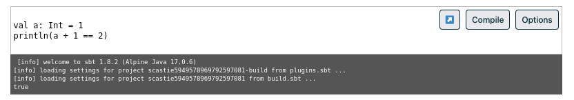

[](https://www.npmjs.com/package/scastie.js)

# scastie.js

Component that adds the capability to run Scala code from any HTML block element. The compilation results will be shown in a console simulation shown under the code block. The Scala code runs through [Scastie](https://scastie.scala-lang.org/), an interactive web browser playground for Scala supported by the [Scala Center](https://scala.epfl.ch/).

## Preview



## Develop and contribute

From this repository:

1. Install required dependencies: `npm install`.
2. `npm start` to start a local development server at http://localhost:8080.

### Release

1. Update version in `package.json` and create tag.
2. `npm run build:production` to create production bundles.
3. `npm publish --dry-run` to check the publication
4. `npm login`
5. `npm publish`

## Installation

### Load it from a CDN

Generate the library through the proper `npm` script, then host it and insert a `<script>` element into your page Currently, after loading you need an additional process to execute the plugin, using a second `<script>` element. Like this:

```html
<script src="https://unpkg.com/scastie.js"></script>

<script>
  document.addEventListener("DOMContentLoaded", function () {
    scastie_js();
  });
</script>
```

### Host your own instance

Install scastie.js as dependency via NPM.

```bash
npm install scastie.js -S
```

And then just use it in your code.

```js
// ES5
var scastie_js = require("scastie.js");

document.addEventListener("DOMContentLoaded", function () {
  scastie_js({selector: "code"}); // attach to all <code> elements
});

// ES6
import playground from "scastie.js";

document.addEventListener("DOMContentLoaded", () => {
  scastie_js({selector: "code"}); // attach to all <code> elements
});
```

### Options and configuration

scastie.js supports different options, overwriting the defaults by passing an additional configuration object parameter on initialisation. You can define all or any of them, the rest will be taking defaults.

For example:

```js
const config = {
  selector: "pre code",
  target: {
    scalaVersion: "2.13.10",
    tpe: "Jvm"
  },
  libraries: [
    {
      groupId: "com.twitter",
      artifact: "util-core",
      version: "22.12.0",
      target: {
        scalaVersion: "2.13.10",
        tpe: "Jvm"
      }
    }
  ],
  theme: {
    primary: "#002b36",
    secondary: "#aaa",
    console: "#555555", 
    borderRadius: "2px"
  }
};

scastie_js(config);
```

Most of these values could be configured per each code snippet through a basic user interface by clicking the _Options_ button. 

**Options description:**

- `selector` — The HTML DOM query selector defining the elements where scastie.js should run on, e.g:
  ```js
  {
    selector: ".code-block-class-selector"
  }
  ```

- `target` — Scala version to compile the code to. `tpe` could be `Scala3`, `Jvm`, `Js`. e.g:
  ```js
  {
    target: {
      scalaVersion: "3.2.2",
      tpe: "Scala3"
    }
  }
  ```

- `libraries` — Array of dependency libraries to load on your compilation. Bear in mind that, besides the general build, you need to specify the Scala target for each additional dependency, e.g:
  ```js
  {
    libraries: [
      {
        groupId: "com.twitter",
        artifact: "util-core",
        version: "22.12.0",
        target: {
          scalaVersion: "2.13.10",
          tpe: "Jvm"
        }
      }
  }
  ```

- `theme` — Some options to adapt the look and feel of the few elements that scastie.js renders, e.g:

  * `primary` — Text and buttons outline colour.
  * `secondary` — Buttons background colour.
  * `console` — Console background colour.
  * `borderRadius` — Elements border radius (buttons, dialog, inputs).
  ```js
  {
    theme: {
      primary: "#002b36",
      secondary: "#aaa",
      console: "#555555", 
      borderRadius: "2px"
    }
  }
  ```


